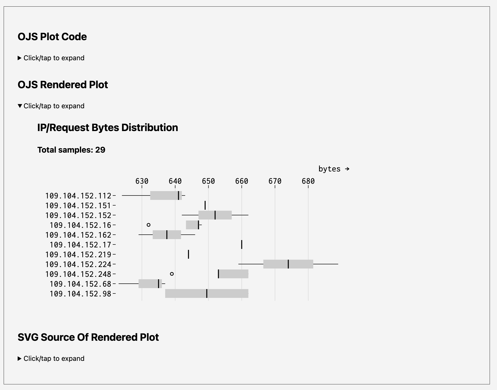

# Bonus Drop #23 Companion Repo

The live site is at <https://rud.is/wpe/2023-08-27/>.

The entire site is written in Vanilla JS with Lit webcomponents. All you need is a web server to kick the tyres. No "npm". 

Consider using one from <a href="https://dailyfinds.hrbrmstr.dev/p/drop-145-2022-11-29-http-right-now">Drop #145</a>.



Directory layout:

```plain
.
├── README.md
├── components
│   ├── plot-element.js
│   └── shiki-element.js
├── css
│   └── index.css
├── data
│   ├── ip-bytes.json
│   ├── mtcars.csv
│   └── tags-ips.json
├── dist
│   └── onig.wasm
├── favicon.ico
├── index.html
├── js
│   ├── d3.js
│   ├── plot.js
│   └── shared.js
├── languages
│   ├── abap.tmLanguage.json
│   ├── actionscript-3.tmLanguage.json
│   ├── ada.tmLanguage.json
│   …
│   └── zenscript.tmLanguage.json
├── preview.png
├── shiki
│   ├── LICENSE
│   ├── README.md
│   ├── dist
│   │   ├── index.browser.mjs
│   │   ├── index.d.ts
│   │   ├── index.esm.js
│   │   ├── index.js
│   │   ├── index.jsdelivr.iife.js
│   │   ├── index.unpkg.iife.js
│   │   └── onig.wasm
│   ├── package.json
│   └── samples
│       ├── Marko.sample
│       ├── abap.sample
│       ├── actionscript-3.sample
│       … 
│       └── zenscript.sample
└── themes
    ├── css-variables.json
    ├── dark-plus.json
    ├── dracula-soft.json
    …
    └── vitesse-light.json
```